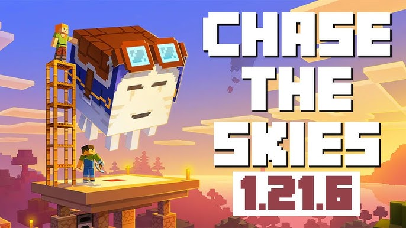
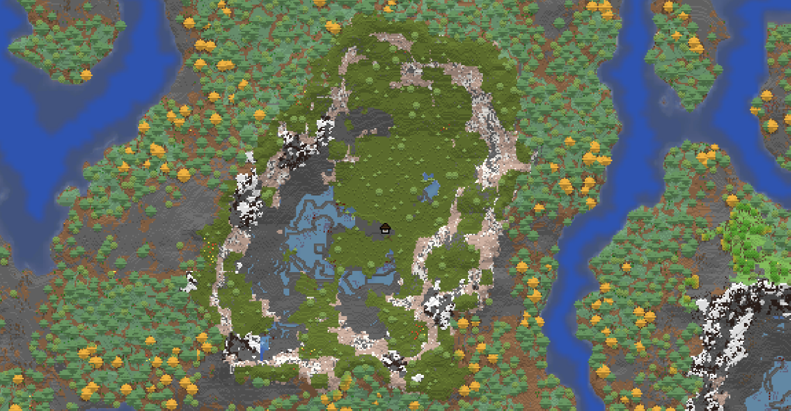
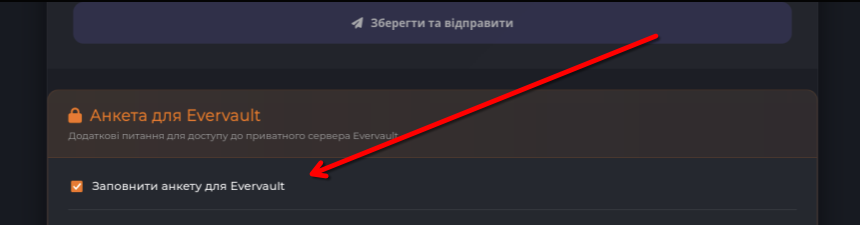

# 🎲 На якій версії буде Evervault?
- 1.21.5 (на момент запуску)
- 1.21.6 (після стабільного релізу)

Цей сервер не залежить від комплексних плагінів, які складно оновлювати на нові версії, тому оновлення версії буде відбуватися швидше, ніж на основному сервері. Щойно вийде стабільна версія ядра, ми будемо її встановлювати та оновлювати світ.

# 🗺 Чи буде доступна онлайн-мапа?
- Так, онлайн-мапа буде доступна

Але трохи в іншому форматі, ніж на основному сервері. Ми плануємо зробити її максимально простою та зручною для навігації, без зайвих деталей, які можуть відвертати від гри.

# 📏 Який буде розмір світу?
- 15,000 х 15,000 блоків — Overworld
- 10,000 х 10,000 блоків — Nether
- 10,000 х 10,000 блоків — The End

У майбутньому розмір світу може бути збільшено, якщо буде потреба. Але на старті ми вважаємо, що цього достатньо для комфортної гри та розвитку. **Однією із важливих особливостей є відсутність пропорції "1 : 8" між Пеклом та Оверворлдом для заохочення використання останнього для переміщення**

# 🔥 Що стосовно спонсорських підписок?
Синхронізовано з основним сервером, більшість функцій буде доступна:
- Вся косметика
- М'які іграшки
- Особисті сповіщення
- Музичні платівки
- Розширене озеленення
- Чат MC-Discord

# 📝 Як потрапити?
Заповнити анкету-допуск. Вона буде доступна на сторінці з анкетами, якщо обрати опцію **"Заповнити анкету для Evervault"**, поруч із кнопкою збереження заявки на основний сервер.

🧵 Дискусії, зворотній зв'язок і вся координація — скоро в мультифорумі.
