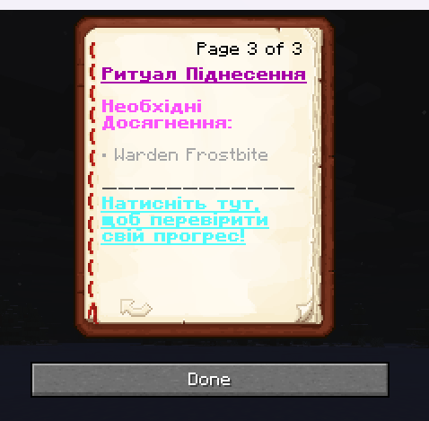
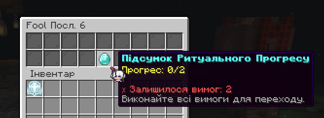

# 🏁 Кінцеве оновлення Магіку

Це останнє оновлення магічного сервера UAProject, яке завершує цикл змін, розпочатий 7 місяців тому (аж півроку!). Ми вдячні всім гравцям за підтримку та відгуки протягом цього часу. Магічна система отримала фінальні зміни, які не будуть змінюватися до кінця магічного сезону. На що очікувати далі - читайте далі.

# 👑 Оновлення нагород Вузлів
Для наступних Вузлів було оновлено таблиці з нагородами:
- **Перший Вузол**
- **Другий Вузол**
- **Третій Вузол**
- **Четвертий Вузол**

Поточні таблиці з нагородами будуть актуальні до кінця магічного сезону, без тижневої ротації. Take your time, діставайте нагороди, які вам потрібні, та насолоджуйтеся ендгейм контентом!

Подивитися актуальні таблиці з нагородами можна на [вікі UAProject](https://docs.uaproject.net/magic/mdloot/).

# 🗽 Розширення магії

Для всіх доступних шляхів магії були додані четверті рівні. Тепер кожен шлях має в собі 9-4 рівні, із усіма можливостями отримати нижчі рівні, та використовувати їх у грі:
- **Сонце** - ☀️ (9-4 + **Міфічна Форма**)
- **Брама** - 🚪 (9-4 + **Міфічна Форма**)
- **Тиран** - 👑 (9-4 + **Міфічна Форма**)
- **Блазень** - 🤡 (9-4 + **Міфічна Форма**)
- **Жрець** - ⛪ (9-4 + **Міфічна Форма**)
- **Демонеса** - 👹 (9-4 + **Міфічна Форма**)
- **Парагон** - 🧪 (9-4 + **Міфічна Форма**)
- **Помилка** - ❌ (9-4 + **Міфічна Форма**)
- **Провидець** - 🔮 (9-4 + **Міфічна Форма**)
- **Повішаний** - 🪢 (9-4 + **Міфічна Форма**)
- **Фортуна** - 🍀 (9-4 + **Міфічна Форма**)
- **Темрява** - 🌑 (9-4 + **Міфічна Форма**)

Інгредієнти, рецепти, зілля та характеристики для четвертих рівнів будуть незабаром додані до існуючих (чи нових?) босів відкритого світу.

# 🪽 Покращені Міфічні Форми

Міфічні Форми отримали значні покращення, які дозволяють використовувати їх більш ефективно, і вони мають не тільки візуальні зміни, але й механічні. Тепер:
- Активація Міфічної Форми надає позитивні ефекти **поглинання**;
- Міфічна Форма кожного шляху покращує ваші **атрибути**;
- Більшість Міфічних Форм мають **унікальні здібності** свого шляху
- Додані видовищні анімації для трансформації в Міфічну Форму;

Натомість встановлений кулдаун на використання Міфічної Форми - рівно **5** хвилин

# 📑 Рецепти та Ритуали

Всі ритуали для всіх шляхів та послідовностей (дослівно) були змінені або створені. Раніше для більшості шляхів було достатньо виконати якусь одну дію, а для деяких послідовностей взагалі не було ритуалів. Тепер же кожен шлях має свій унікальний ритуал, який потрібно виконати для отримання здібностей.

Ритуали реалізовані у вигляді **досягнень**, які вам потрібно буде виконати. Знайти перелік можна на третій сторінці кожного рецепту. Якщо ви не впевнені, чи виконали всі умови ритуалу, ви можете перевірити це, натиснувши на кнопку **"Перевірити свій прогрес"**:

# 👽 Потойбічні Створіння... що з ними?

Систему Потойбічних Створінь було повністю перероблено. Більшість змін стосуються задньої частини плагіну, але з того, що важливо знати вам: **ХП** та **шкода** певних істот була **переглянута**. Дроп інгредієнтів з них міг трошки змінитися в процесі, але в цілому залишився незмінним!

# 🎈 Що далі?

На цьому оновленні закінчується моя активна участь в розвитку сервера UAProject. Для цього є багато причин, серед тих, що можна озвучити:

- Гнітюче ставлення до моєї роботи, та постійні звинувачення в тому, що я щось роблю не так;
- Неможливість реалізувати свої ідеї та бачення розвитку сервера, через постійні зауваження та критику;
- Відсутність можливості вважати себе повноцінним власником сервера, існування "даху" кар'єрного зросту;
- Зацикленість на старих механіках, ванільному компоненті гри, та відсутності бажання розвиватися далі;
- Особиста неприязнь до деяких гравців, але відсутність можливості уникати щоденної взаємодії з ними;
- В цілому негативний досвід від процесу керування проєктом, та відсутність бажання продовжувати його, принаймні в такому вигляді, який він є зараз.

Разом із собою я забираю Магічний сервер (а також Магічний Бедварс), та продовжу його розвиток в іншому місці, так, як вважаю за потрібне. Сам UAProject **продовжить своє існування** у вигляді ванільного **Evervault**, існуючого веб-сайту, та Discord-серверу, оновлень під керівництвом Ведучого, які будуть відповідати за розвиток Evervault (оновлення, івенти, нові механіки тощо). 

**Я не кидаю сервер**, і досі буду відповідати за його технічну частину, оновлення та технічну підтримку, але основний фокус буде зміщений на новому проєкті, який я планую запустити найближчим часом. У вас є **щонайменше місяць**, щоб отримати всі нагороди, які вам потрібні, розвинутися до найнижчого рівня свого шляху та насолодитися останніми змінами в магії UAProject, і попрощатися з нею.

**Сервер не закривається**, ви і надалі можете приходити кожного вечора, грати, спілкуватися, та отримувати задоволення від гри. Я залишаюсь у Discord-сервері UAProject, і буду радий відповісти на ваші запитання, допомогти з проблемами, та підтримувати зв'язок з вами.

Я вдячний всім, хто підтримував мене протягом цього часу, та сподіваюся, що ви знайдете нові шляхи для розвитку та гри на UAProject.

(c) ikipcom, 02.08.2025