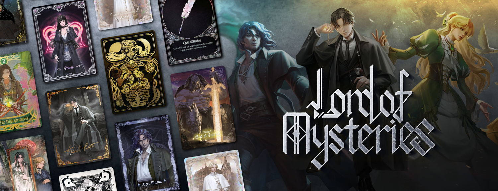

# 👑 Оновлення нагород у Вузлах
Для наступних Вузлів було оновлено таблиці з нагородами на цей тиждень:
- **Перший Вузол** (new! Парагон 9 - 8)
- **Другий Вузол** (new! Парагон 7)
- **Третій Вузол** (new! Парагон 6)
- **Четвертий Вузол** (new! Парагон 5)

Наступне оновлення буде рівно через тиждень, **12.07.2025**!

# 🐞 Щотижневий звіт про проблеми
Короткий дайджест усього, що сталось [у форумі](https://discord.com/channels/1221552838807654450/1311698848095277127) за цей тиждень:
- Оновлення CoiClient до версії **1.21.6** (виправлення помилок, оптимізація)
- Виправлення помилок локалізації для Піроманіяка (Жрець)
- Синхронізація РП на всіх серверах UAProject

# ⚙️ Новий шлях: "Парагон"!

Цей шлях було обрано гравцями в рамках голосування в Discord. Парагон — це шлях, який спеціалізується на пізнанні світу природи та створенні предметів. Вони мають відмінні наукові знання, історичні знання, механічні знання, можуть створювати потужну потойбічну зброю, а також інтуїтивно розуміють, як використовувати та уникати недоліків запечатаних предметів.

Перший шлях, який має можливість створювати спеціальні предмети, доступні лише для цього шляху. Перший шлях, який має можливість створювати Запечатані Артефакти із Потойбічних Характеристик, Інгредієнтів та інших предметів.

# 🧐 Де знайти ресурси для Парагону?
У першу чергу їх можна знайти в [Потойбічних Вузлах](https://docs.uaproject.xyz/magic/nodes/). Це спеціальні локації, де ви можете знайти Потойбічні Характеристики, Інгредієнти та інші корисні предмети. Також ви можете знайти їх у звичайних світах UAProject, але вони будуть рідкісними.

Також незабаром планується реалізація босів відкритого світу, які будуть давати можливість отримувати ці предмети іншим чином. Але тссс, це поки що секрет!

# 🍭 Запечатані Артефакти?

**Запечатані Артефакти** — це спеціальні предмети, які можна створити за допомогою Потойбічних Характеристик та Інгредієнтів. Вони мають унікальні властивості, та дозволяють використовувати магічні здібності інших шляхів без витрат духовності. Своєю чергою, вони мають ряд недоліків, які будуть прямо негативно впливати на гравця, якщо він їх використовуватиме.

До цього їх можна було отримати лише, якщо якомусь магу не пощастило втратити контроль, і перетворитися в Потойбічного Монстра. Тепер же вони стануть більш розповсюдженими, і їх можна буде отримати за допомогою шляху Парагона.