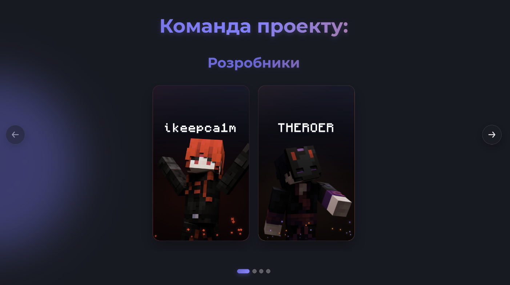
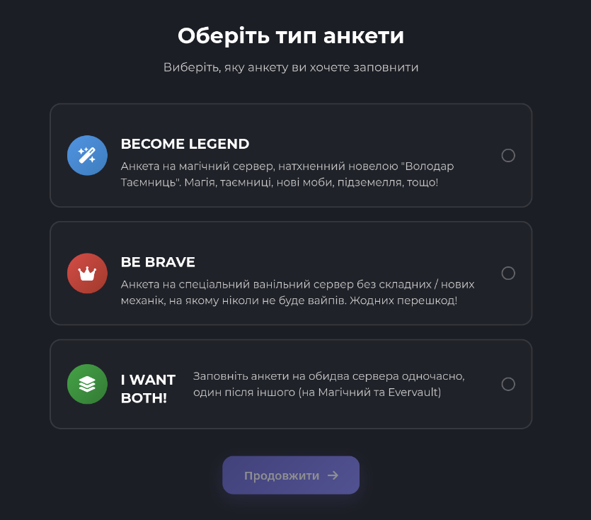
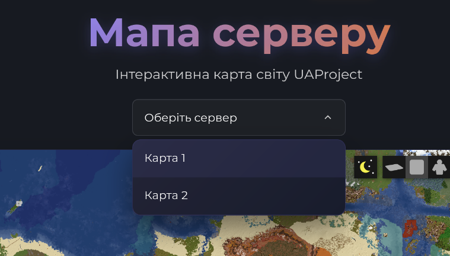

# 👑 Оновлення нагород у Вузлах
Для наступних Вузлів було оновлено таблиці з нагородами на цей тиждень:
- **Перший Вузол**
- **Другий Вузол**
- **Третій Вузол**
- **Четвертий Вузол**

Наступне оновлення буде рівно через тиждень, **19.07.2025**!

# 🐞 Щотижневий звіт про проблеми
Короткий дайджест усього, що сталось [у форумі](https://discord.com/channels/1221552838807654450/1311698848095277127) за цей тиждень:
- Виправлена проблема пов'язана з реконнектом до матчу в BedWars
- Виправлено помилку голосування за магію в BedWars
- Збільшено час зникнення простих предметів з 7 секунд до 2.5 хвилин
- Виправлено помилку, через яку РП завантажувався дуже повільно
- Виправлено помилку, через яку спектатори могли підривати міни Жреця
- Покращено обрахування шкоди для магічних атакувальних здібностей
- Покращено прогресію Повітряної Кулі Блазня від рівня мага

# 🫠 Вимір Краю вже наступного тижня!

Не хочемо відвертати вас від дослідження нових можливостей шляху Парагона, а також розвитку на сервері Evervault, тому відкриття Краю було перенесено на наступний тиждень. Відкриття Краю відбудеться **19.07.2025** о 10:00 за київським часом.

Протягом цього тижня магічний сервер буде йти на нічні технічні роботи, щоб підготуватися до відкриття Енду. У періоди з 23:00 до 07:00 магічний сервер буде недоступний. Це дозволить нам попередньо згенерувати територію виміру, щоб його відкриття пройшло без проблем.

# 📶 v2.0 сайту? Пх, розроблюємо v3.0!

Протягом цього тижня ми активно працювали над новою версією сайту UAProject, яка буде мати більше нових можливостей та покращень. Деякі з них уже доступні:

> Оновлений слайдер команди проєкту, який тепер показує більше учасників команди та їх ролі.

> Можливість обрати анкету, яку ви хочете заповнити.

> Онлайн-мавпа сервера Evervault.

# 🛌 Турнір BedWars наступних вихідних!

Слідкуйте за новинами в Discord, адже вже наступних вихідних ми проведемо турнір з BedWars! Це буде чудова можливість показати свої навички та можливість виграти **грошовий** приз. Більше деталей буде оголошено найближчим часом в окремому анонсі.