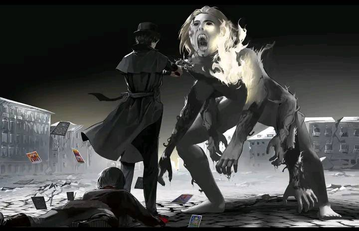

# 👑 Оновлення нагород у Вузлах
Для наступних Вузлів було оновлено таблиці з нагородами на цей тиждень:
- **Перший Вузол**
- **Другий Вузол**
- **Третій Вузол**
- **Четвертий Вузол**

Наступне оновлення буде рівно через тиждень, **25.07.2025**!

# 🐞 Щотижневий звіт про проблеми
Короткий дайджест усього, що сталось [у форумі](https://discord.com/channels/1221552838807654450/1311698848095277127) за цей тиждень:
- Виправлена помилка роботи здібності "Тіньовий Слуга" в BedWars
- Виправлено помилку, через яку гравців кікало за "політ" на Evervault
- Виправлено помилку пов'язану з голосуванням за магію в BedWars
- Прибрано "Двері Мандрівника" із дозволених здібностей в BedWars
- Виправлено помилку пов'язану з активними здібностями в BedWars
- Виправлено помилку, через яку гравців кікало за "політ" в BedWars
- Локалізовано помилку, через яку Автокрафтер не працював як треба

# 🏁 Відкриття Енду

Останній вимір відкривається вже завтра — **19.07.2025** о 10:00 за київським часом! 

Для цього магічний сервер піде на тех. роботи сьогодні вночі, у період з **23:00** до **07:00**, щоб завантажити територію виміру, і забезпечити стабільне відкриття виміру без технічних проблем, та низького ТПС. Для всіх магів виділю жирним текстом: **протягом перших 48 годин із початку відкриття виміру, магічний сервер буде працювати в режимі "м'якого відкриття". Це означає, що ви зможете досліджувати вимір, але не зможете використовувати магічні здібності.** Це забезпечить рівні шанси дослідити нові горизонти для всіх гравців, і не дозволить Потойбічних деяких шляхів отримати вбивчу перевагу над іншими.

# 🎆 Зустрічаємо рівні напівбогів!

Рівні магії для шляхів починають розширятися, протягом цього тижня ми активно розроблювали нові рівні магії для шляхів, і вже можемо представити вам деякі з них:
- **Темрява:** Міфічна Форма + 4-й рівень
- **Демонесса:** Міфічна Форма + 4-й рівень
- **Брама:** Міфічна Форма + 4-й рівень
- **Помилка:** Міфічна Форма + 4-й рівень
- **Сонце:** Міфічна Форма + 4-й рівень
- **Блазень:** Міфічна Форма + 4-й рівень

Рівні для інших шляхів будуть додані протягом цього тижня, без очікування на вихід ТО (тижневого оновлення). До вже реалізованих рівнів будуть застосовані балансні зміни, додані ритуали, а розробка рівня Святих почнеться після завершення всього рівня напівбогів. Для гарної реалізації потрібен час, тому набираємося терпцю!

# 🛌 Зміни в регламенті турніру по BedWars

На жаль, активність стосовно анонсованого турніру не виправдала наших очікувань, за наданий час для реєстрації команд не було набрано достатньої кількості гравців для проведення повної запланованої турнірної сітки. 

Продовжуємо час для реєстрації ще на два дні (до 20.07.2025), а сам турнір переносимо на вівторок (22.07.2025). Призовий фонд зменшується до 1,000₴ та 1,000UNI загалом, із наступним розподілом:
1. **🥇‑ше місце**:
- **600 грн, 600 UNI**
2. **🥈‑ге місце**:
- **300 грн, 300 UNI**
3. **🥉‑тє місце:**
- **100 грн, 100 UNI**

Сподіваємося, що це стане "бета-тестом" офіційних турнірів від UAProject, і майбутні анонси знайдуть більше розповсюдження серед українського ком'юніті.

# 🚓 Що нового принесуть рівні напівбогів?

Разом із відкриттям Енду, а також розширення магічних рівнів, для лідерів "магічного" рейтингу буде додано аж 3 нові механіки:
- Міфічна Форма
- Почесні Імена
- Риса

Коротко пройдемося по кожній з них в окремих пунктах нижче:

### 🐦‍🔥 Міфічна Форма

У символічній назві рівня "напівбогів" присутня частичка "бог". Це означає, що це якісна зміна Потойбічного, і вона надасть йому певний рівень "божественності". Отже, що таке Міфічна Форма?

Міфічна Форма Істоти - це трансформація. Трансформація в Міфічну Істоту, асоційовану із шляхом, по якому взбирається гравець. Трансформація на 3-4 рівнях буде використовувати духовність, натомість надавати бафи та міняти зовнішній вигляд. Також запам'ятайте одне просте правило - **НА БОГА НЕ МОЖНА ДИВИТИСЯ**. Маги низьких рівнів будуть отримувати шкоду, якщо будуть дивитися прямо на активовану Міфічну Форму.

### 📛 Почесні Імена

Кожен напівбог після свого народження зможе встановити собі Почесне Ім'я — чотири унікальні рядки, які будуть описувати його як потенційного Бога шляху. Якщо інший гравець прочитає (напише в чат) ці чотири рядки, сам напівбог відчує це з будь-якого кутку світу, і зможе виконати низку дій. Яких саме, поки не скажемо :)

### 🔋 Риса
Для того, щоб стати справжнім жителем Астрального світу, та здобути нульовий рівень послідовності - мати рецепт, виконаний ритуал та зілля - недостатньо. Щоб стати 'Ним' треба мати внутрішній стрижень, Рису. Як її здобути - невідомо, але можливо, тільки можливо, що відіграння свого персонажа має до цього якесь відношення?