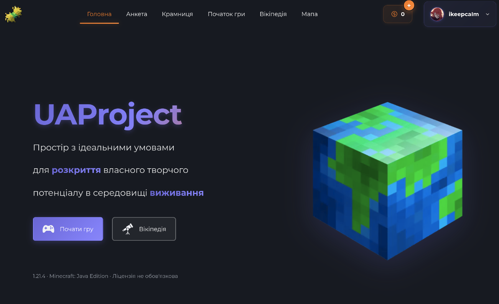
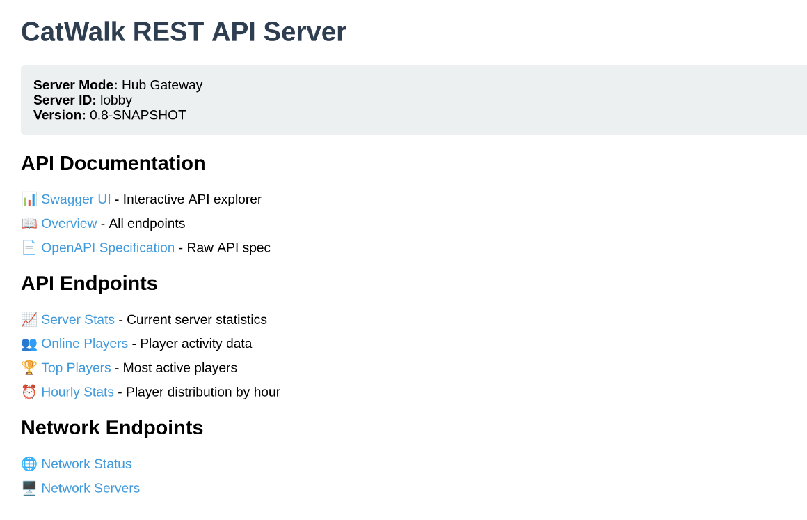

# 👑 Оновлення нагород у Вузлах
Для наступних Вузлів було оновлено таблиці з нагородами на цей тиждень:
- **Перший Вузол**
- **Другий Вузол**
- **Третій Вузол**
- **Четвертий Вузол**

Наступне оновлення буде рівно через тиждень, **28.06.2025**!

# 🐞 Щотижневий звіт про проблеми
Короткий дайджест усього, що сталось [у форумі](https://discord.com/channels/1221552838807654450/1311698848095277127) за цей тиждень:
- Мутовані Потойбічні Монстри більше не верещать
- Виправлене форматування повідомлення про голосування

# 🌱 Підготовка до оновлення сайту
Ми готуємося до оновлення сайту UAProject, яке включатиме:
- Новий дизайн, 
- Покращену навігацію,
- Нові функції:
  - Суддівства ✨
  - Тікети підтримки ✨
  - Убудовані новини ✨
  - Профілі користувачів ✨
- Оновлені анкети
- Анкета на Evervault ✨
- і багато іншого!

Ми плануємо запустити оновлення протягом наступних кількох днів / за готовності. Слідкуйте за новинами в Discord, щоб не пропустити важливі зміни!

# 💻 Супровід оновленого сайту

Для того, щоб новий сайт мав усі можливості для коректної роботи, ми оновили серверну частину проєкту. Це надасть нам змогу:
- Легше додавати нові функції
- Покращити продуктивність
- Забезпечити кращу стабільність роботи сайту
- Легко додавати підтримку нових серверів, таких як Evervault
- Забезпечити кращу інтеграцію з Discord та іншими сервісами
- Забезпечити кращу безпеку та захист від атак

І хоча це не вплине на гравців безпосередньо, ми сподіваємося, що це дозволить нам розвивати UAProject ще швидше та якісніше.

# 🏰 Більше про Evervault
Як ви вже могли прочитати в [першому анонсі](https://news.uaproject.xyz/welcoming-evervault), ми запускаємо новий сервер Evervault. Це експериментальний світ, який може стати постійною частиною UAProject, або ж залишиться лише тимчасовим проєктом. Цього разу ми підготували більше деталей про Evervault, які ви можете знайти в [новому дописі](https://news.uaproject.xyz/pre-start-evervault).