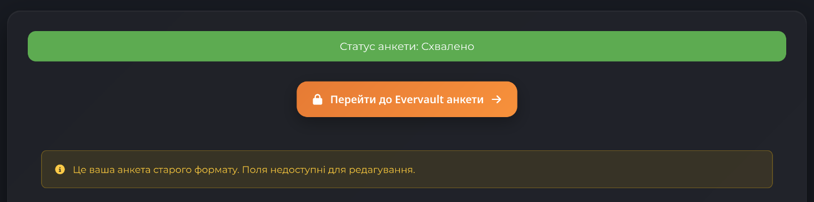

# 👑 Оновлення нагород у Вузлах
Для наступних Вузлів було оновлено таблиці з нагородами на цей тиждень:
- **Перший Вузол**
- **Другий Вузол**
- **Третій Вузол**
- **Четвертий Вузол**

Наступне оновлення буде рівно через тиждень, **05.07.2025**!

# 🐞 Щотижневий звіт про проблеми
Короткий дайджест усього, що сталось [у форумі](https://discord.com/channels/1221552838807654450/1311698848095277127) за цей тиждень:
- Виправлення помилок у роботі плагіну Towny (міста та поселення)
- Виправлення здібності "Накопичення Удачі" Фортуни
- Потенційні виправлення голосування за магію на BedWars
- Тепер оптимізованих селян можна прив'язати повідком
- Прибрані дублікати повідомлень "Пісні Сирени", перекладені на українську

# 🔃 Актуалізація Вікіпедії

Дякуємо **@zik_98** за актуалізацію Вікіпедії UAProject! Тепер ви можете знайти більше інформації про різні аспекти гри, опис здібностей відносно нових шляхів, уточнення інформації стосовно наявних механік тощо. Якщо ви хочете допомогти з редагуванням або додаванням нових статей, звертайтеся до **@zik_98** у Discord.

# 📍 Оновлення сайту UAProject
✨ Це нарешті відбулося! Найбільше оновлення сайту UAProject за останні роки нарешті готове до запуску. Ми підготували багато нововведень, які зроблять ваш досвід користування сайтом ще кращим. На поточний момент уже доступні такі можливості:
- Анкета версії **2.0**
- Анкета Evervault ❤️‍🔥
- Список інших гравців
- Оновлена статистика про себе
- Оновлений профіль користувача
- Крамниця та список товарів

# 🍹 Запуск Evervault вже цього тижня!
Це дійсно так! Ми запускаємо Evervault вже цього тижня, і ви зможете приєднатися до бета-тестування. Якщо ви ще не заповнили анкету, зробіть це зараз, щоб отримати доступ до нового світу. Більше деталей про Evervault можна знайти в [окремому анонсі](https://news.uaproject.xyz/pre-start-evervault).

Заповнити анкету можна [тут](https://www.uaproject.xyz/form). Для цього потрібно увійти в акаунт UAProject, якщо ви ще не зробили цього. Щоб перейти до анкети Evervault, оберіть опцію **"Перейти до Evervault анкети"** поруч із кнопкою збереження заявки на основний сервер.

Майте на увазі, що у вас буде лише **одна** спроба заповнити анкету, тому будьте уважні при виборі відповідей. Для охочих підтримати проєкт фінансово, ми пропонуємо можливість отримати доступ до Evervault за допомогою платного допуску **(80₴)**. Це дозволить вам отримати додаткові можливості та підтримати розвиток. Якщо бета-тестування Evervault буде успішним, ми плануємо зробити його постійним сервером UAProject. Якщо ж ні — ви отримаєте компенсацію у вигляді **80 UNI** на ваш баланс, які ви зможете використати для інших цілей на основному сервері.

# 🎆 Аніме-адаптація Володаря Таємниць!
Якщо раптом ви не знаєте, але магічна система основного сервера протягом 5 та 6 сезонів була натхненна веб-новелою "Володар Таємниць" (Lord of The Mysteries by Cuttlefish That Loves Diving). І ми раді повідомити, що вийшла офіційна аніме-адаптація цієї історії! Ви можете знайти її на [Crunchyroll](https://www.crunchyroll.com/series/GEXH3W2EZ/lord-of-mysteries) та інших платформах. Це чудова можливість зануритися в атмосферу світу, який надихнув нас на створення магічної системи UAProject.

P.S. Також можна подивитися із субтитрами на [HiAnime](https://hianime.to/watch/lord-of-mysteries-19802), але я цього не казав :'