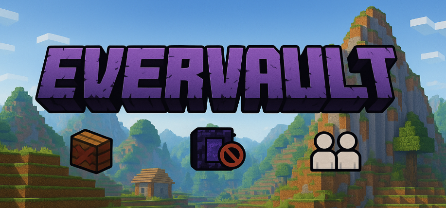

# 📢 Привіт, гравці UAProject!
Ми запускаємо **бета-тест** нового серверного світу. **Evervault** — світ, який може стати постійною частиною проекту — або не стати. Все залежить від вас, від фідбеку, активності і того, чи буде він комусь реально цікавий. Це не заміна, не "новий вайп", не "втеча з магії", не "тільки для еліти" — це експеримент, який ми запускаємо разом із вами.

# 🧱 Що таке цей Evervault-сервер?
Усе просто, але важливо:
- Це окремий світ, повністю незалежний від магічного, міні-ігор чи чогось іншого.
- Жодних вайпів. Світ буде жити, скільки потрібно — навіть на етапі тестування.
- Доступ — тільки по анкеті. Не для "всіх підряд", щоб уникнути проблем з тими, хто просто прийшов побігати та поруйнувати все.

######  Ви самі вирішите, що там буде і як воно має виглядати.

# 🧭 Що там буде на старті?
- Абсолютно чистий світ. Мінімум особливостей, плагінів та несерйозності.
- Немає звичної швидкості, немає телепортів, немає купи гівенів.
- **Виживання — у найпрямішому сенсі.**
- Атмосфера та хардкор. Якщо ти любиш імерсивний світ і повільне, але ґрунтовне будівництво — це для тебе.
- Величезна мапа — з місцем для всіх, але без купи “сміттєвих” баз кожні 100 блоків.

# ⚠️ Інший формат — інші правила
Цей сервер не буде "як основа, тільки без вайпів". Ми тестуємо зовсім інший підхід до гри:
- Темп повільніший. Без динамічних перегонів за ресурсами чи рівнями, котрі ви так любите, і дуже швидко від них вигораєте. Усі виміри відкриті із самого початку.
- Фокус на атмосфері, взаємодії між гравцями, спільних проєктах, тривалих ідеях.
- Мінімум систем і автоматизацій. Максимум змісту й логіки.
- Магії, тауні, нестандартних монстрів і ресурсів — не буде на старті, і якщо колись з’являться — то лише за спільним рішенням гравців і в  жорстко обмеженому форматі.

Це — не “серйозно” в сенсі "суворо й нудно", а серйозно як “глибше, повільніше, змістовніше”. Якщо в основі ти міг улітку зайти, політати, умерти, зробити ферму за 2 дні й зникнути на рік — то тут такий стиль гри не працюватиме.

**Evervault** — це не для всіх. І в цьому його суть.

# 🎯 Навіщо це все?
Цей сервер — експеримент, який дасть відповіді на ключові питання:
- Чи реально комусь цікаво будувати щось стабільне, коли прогрес не зітреться через вайп?
- Чи можна зібрати ядро людей, які цінують повільну та комфортну гру, атмосферу та взаємоповагу?
- Чи потрібні плагіни взагалі, чи гра може бути цікавою на ванілі+?

# 🗓️ План тестування:
1. Тиждень 1–2:
- Запуск світу в найпростішому вигляді.
- Відкриття фідбек-каналу.
- Обговорення того, що додати (але нічого ще не додаємо).
2. Тиждень 3+:
- Можливе додавання перших особливостей.
- Тільки на основі загального голосування/відгуків.
3. Через 1 місяць:
- Оцінка результатів.
- Рішення: залишаємо як постійний сервер або закриваємо повністю.

# 📌 Декілька принципових речей:
- Це не про перегони, а-ля “я перший прокачаю магію” чи “Пекло відкрите вже 0.0001 секунди, я маю розграбувати його все!!!”
- Це про глибину, світ, історії, проєкти, бази, поселення.
- Ніхто вас не примушує. Це не обов’язково, не “всі переходьте”. Це — для тих, кому хочеться чогось іншого.
- **Ваша думка має значення.**
- *Реально*. Тут не буде “адміни вирішили”. Тут гравці вирішують, чи це має майбутнє.
- Саме тут ви зможете не хвилюватись, що історія, яку ви творили весь сезон, літо чи навіть канікули — зникне. Вона буде тут завжди.

# 📝 Як потрапити?
Заповнити анкету-допуск (буде доступна окремо). Це не іспит, але ми хочемо бачити:
- Чи розумієш ти, що це за сервер.
- Чи готовий укладати час у довгу гру.
- Чи вмієш жити поруч з іншими гравцями, не трощачи все довкола.
  Грубо кажучи — це шанс створити щось дуже повільне, затишне, атмосферне, майже як свій приватний світ, тільки з іншими людьми, які мислять подібно. Не для всіх. Але якщо для тебе — ти відчуєш це з першого заходу.

🧵 Дискусії, зворотній зв'язок і вся координація — скоро в мультифорумі.
